The AI Agent SDK is a developer framework for building and running autonomous agents. It provides a set of tools and components for creating, managing, and deploying agents. These agents operate as a swarm, coordinating and collaborating to achieve complex tasks. The **[Zero-Employee Enterprise (ZEE)](/concepts/zee-workflows)** is a new business model where traditional workforces are augmented by these autonomous agents.

The Agent SDK supports single model inference calls to multi-agent systems that use tools. The SDK provides primitives that are designed to be easily composable, extendable and flexible for advanced use cases.

## How the SDK works

```mermaid
flowchart LR
    %% Styling
    classDef input fill:#ffffff,stroke:#000000,stroke-width:2px, color:#000
    classDef planner fill:#f0f0f0,stroke:#000000,stroke-width:2px, color:#000
    classDef agent fill:#e0e0e0,stroke:#000000,stroke-width:2px, color:#000
    classDef tool fill:#d0d0d0,stroke:#000000,stroke-width:2px, color:#000
    classDef state fill:#fafafa,stroke:#000000,stroke-width:2px,stroke-dasharray: 5 5, color:#000
    classDef llm fill:#ffffff,stroke:#000000,stroke-width:2px, color:#000

    %% Nodes
    inp1("🔄 Input")

    subgraph "Zero-Employee Enterprise"
        direction LR
        planner{"🔍 Planner Agent"}
        router{"🧠 Router Agent"}
        agent1("🤖 Primary Agent")
        agent2("🤖 Support Agent")
        agent3("🤖 Task Agent")
        tool1("⚡ Tool A")
        tool2("⚡ Tool B")
        tool3("⚡ Tool C")
        tool4("⚡ Tool D")
        id1[("💾 Context")]
    end

    subgraph "Language Models"
        direction TB
        llm1[["OpenAI"]]
        llm2[["Google"]]
        llm3[["Anthropic"]]
    end

    %% Connections
    inp1 --> planner
    planner --> router
    router <--> agent1
    router <--> agent2
    router <--> agent3
    agent1 <--> tool1
    agent2 <--> tool2
    agent3 <--> tool3
    agent3 <--> tool4

    %% Apply styles
    class inp1 input
    class planner planner
    class router router
    class agent1,agent2,agent3 agent
    class tool1,tool2,tool3,tool4 tool
    class id1 state
    class llm1,llm2,llm3 llm
```



The SDK enables developers to compose simple single-agent systems or entire systems of agents that work together to form the Zero-Employee Enterprise ([ZEE](/concepts/zee-workflows)). [Agents](/concepts/agents) are the building blocks of the ZEE workflow. Each agent is backed by a language model that can be configured to use a variety of [LLMs](/concepts/llms). Agents can additionally use [Tools](/concepts/tools) to perform actions on the ZEE using outside information.

```typescript
const agent = new Agent({
    name: "Reporting Agent",
    ...
    tools: { tool1, tool2, tool3 },
});

const zee = new ZeeWorkflow({
    goal: "The goal of this workflow is to...",
    ...
    agents: [agent1, agent2, agent3],
});
```

### Concepts

- [LLMs](/concepts/llms) - a unified interface for all LLMs
- [Agents](/concepts/agents) - a single model with a system prompt and a set of tools
- [Tools](/concepts/tools) - extend the capabilities of agents with external tools
- [ZEE Workflows](/concepts/zee-workflows) - compose agents to solve complex problems
